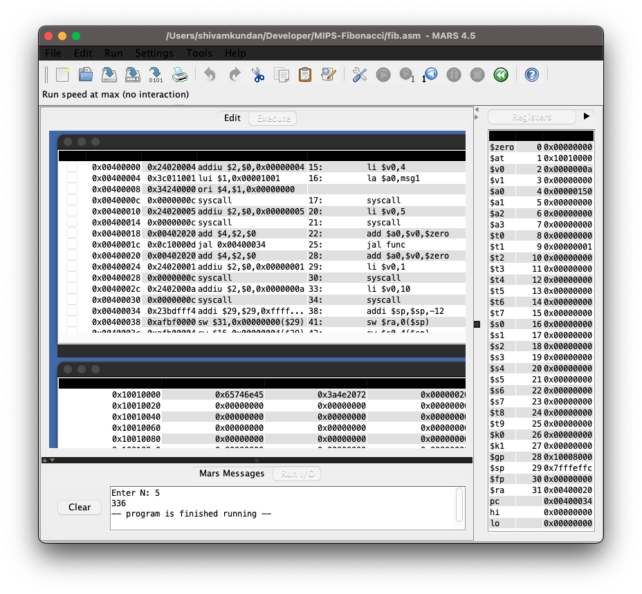

# Fibonacci Sequence in MIPS Assembly

## About
Assembly code for calculating Fibonacci sequence for a given integer input. 

## Simulation
Simulated using MARS MIPS Simulator

### Registers

  

### Animation

  

